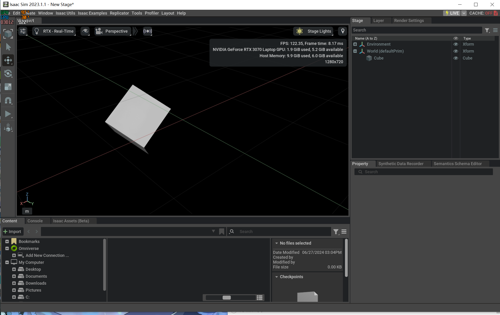
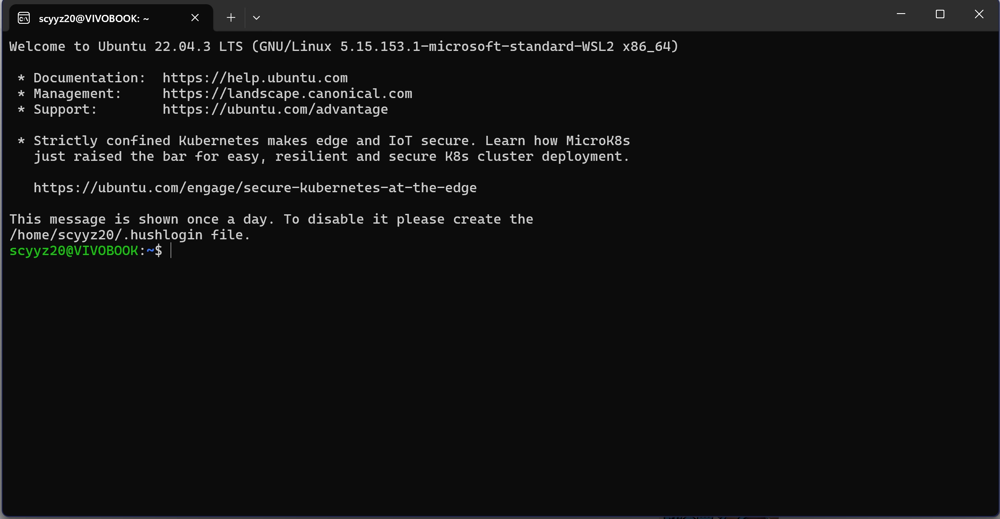
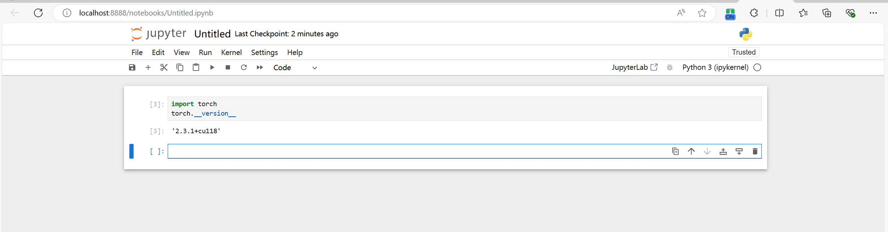

# Week 2

## Study Content

1. Successfully download Isaac Sim, and learn knowledge about it.
   

2. Successfully download Ubuntu.
   

3. Successfully download PyTorch.
   

## Study Difficulties

1. Have difficulties downloading Ros.
2. Isaacsim is prone to become unresponsive when importing sample files.

## Future Plans

1. **Continue completing the CNN course**
    - Further deepen the study of convolutional neural networks, understanding their detailed workings and various variants.
