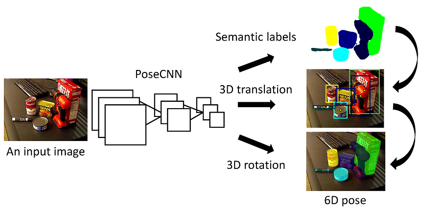
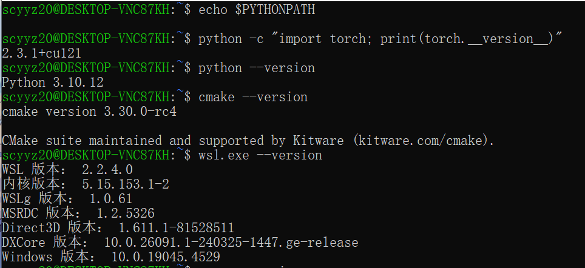
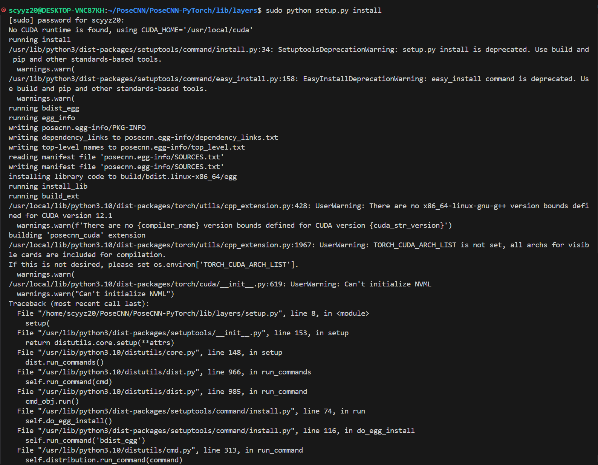
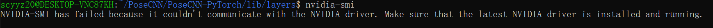

# Week 3

## Study Content

1. Picked a suitable CNN project from github.[PoseCNN-PyTorch](https://github.com/NVlabs/PoseCNN-PyTorch)

2. Learn basic logic of CNN
   

3. Download most of the environments.
   

## Study Difficulties

1. Have difficulties running the code obove. Not sure what is the reason. I have already checked the version of wsl cuda and anything else. 
    
2. Having difficulty loading the NVIDIA driver of Linux.
    

## Reason for not attending the meeting
My family lives not very close to the school, and I have just returned from the UK, so it is not very convenient to rush from home to the school for meetings. But I'll try to keep up with the progress and complete the weekly report.

## Future Plans

1. **Continue completing the Pose-CNN build**
    - Try rebuilding a Linux environment via vmware, updating NVIDIA drivers as well as Windows versions, these may be the issues that cause the version to be inappropriate.
