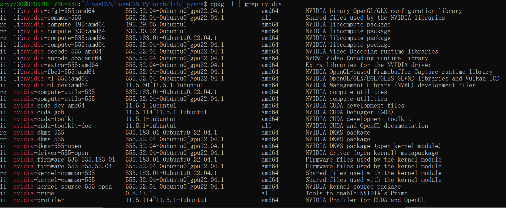
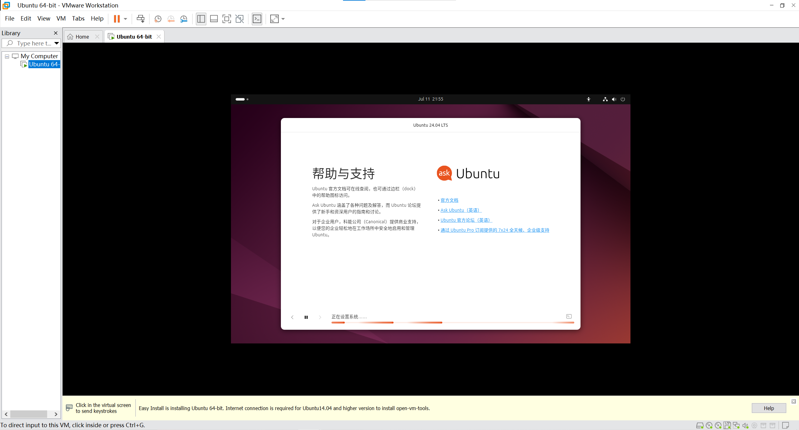
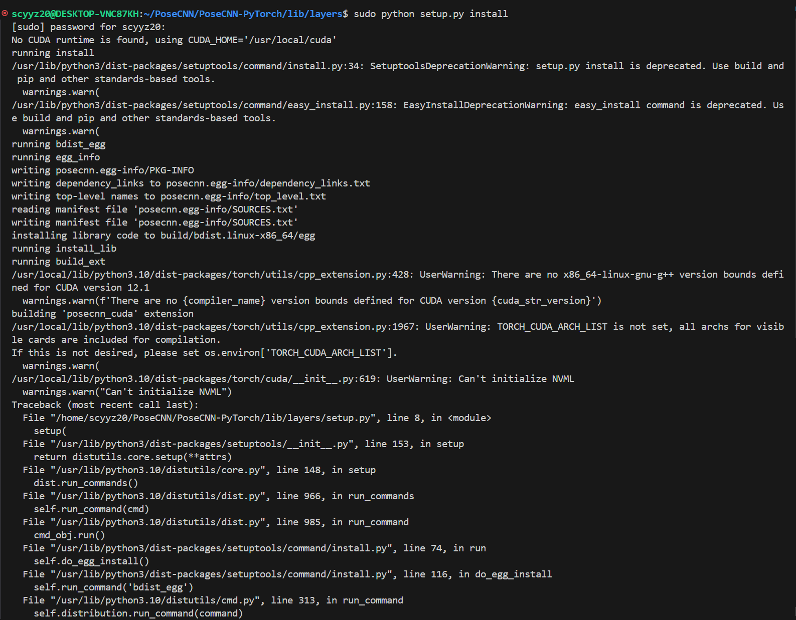
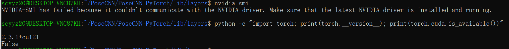

# Week 3

## Study Content

1. Trying to fix NVIDIA driver cannot be used problem.
2. Downloading CUDA,update most of the environment.  
    
3. Trying to usimh VMWARE to avoid problems I meet in WSL.
   

## Study Difficulties

1. Still have difficulties running the code obove in WSL. Not sure what is the reason. Even reinstalling NVIDIA drivers, pytorch, and cuda, including any required nvidia libraries, still fails.
          
    
2. Having difficulty loading the NVIDIA driver of Linux.
    

## Future Plans

1. **Continue completing the Pose-CNN build**
    - Try rebuilding a Linux environment via vmware, updating NVIDIA drivers as well as Windows versions, these may be the issues that cause the version to be inappropriate.
